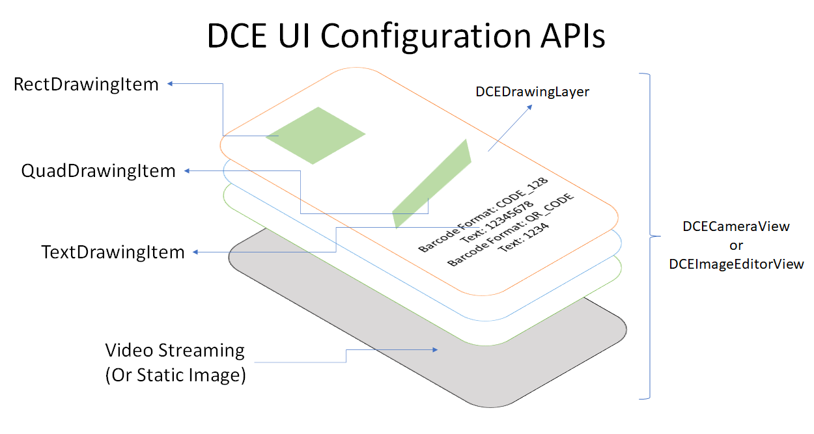
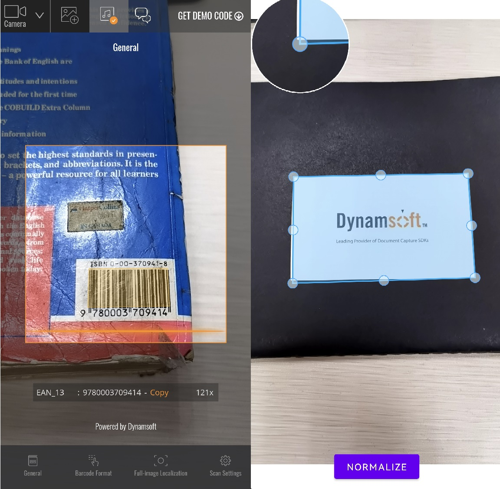

# Overview of Dynamsoft Camera Enhancer

Dynamsoft Camera Enhancer (DCE) is an SDK specially designed to enhance camera frame acquisition process. Its basic camera manipulation features can save developers hundreds of lines of code for integrating camera in their applications. However, what make it unique are its advanced features on frame processing which empower the applications to focus only on high-quality frames and achieve high efficiency and accuracy.

## Main features

### Video Buffer

DCE video buffer is the key feature that speeds up frame acquisition. It also acts as the administrator that takes over the video frames processed by other DCE functions. The main responsibilities of the video buffer are to:

- Temporarily store the filtered and cropped video frames.
- Transfer a new frame immediately when the application finishes the processing of the current frame.
- Enable the applications to skip the time-consuming frames to release the occupancy of computation resources.

When DCE is embedded in an application, the video frames will be preprocessed and temporarily saved in the DCE video buffer. Each time when the application completed the current process, instead of waiting for the camera to transfer a new frame, the application can fetch a new frame from the video buffer immediately. In addition, the video buffer also provides a new solution on the timing out system. By monitoring and controlling the number of frames in the queue, users can enable the application to abandon the current processing frame and restart the scan. The video buffer sharply reduces the lag in the scanning process and it will finally result in a stable and fluent user experience.

### Frame Filtering

DCE can implement the sensor filter and frame sharpness filter on the camera video frames. The blurred frames will be skipped in the image reading process. The filter methods include:

- Sensor filter on mobile devices.
- Frame sharpness filter on all kinds of devices.

The frame filter prevents the frame processing algorithm from spending too much time scanning blurry frames. This benefits the application on improves its working efficiency and accuracy.

### Frame Cropping

**Fast mode** is the pattern in which we process frames by cropping them. We call this pattern `Fast mode` because it sharply reduces the scan area and results in faster processing speed. If the fast mode is enabled, frames will be cropped in four different cropping methods and they will be implemented periodically.

    

    
How fast mode is cropping frames

### Auto Focus

For the low-end cameras, DCE enables users to make autofocus settings on controlling the camera proactively so that we will not stay on the blurry frames. Other focus settings are also available for users to deploy more personalized and advanced camera focus settings.

### Auto Zoom

If the barcode reader is enabled at the same time when DCE is working, we can use the intermediate result of the barcode reader to predetermine the area of interest. DCE will let the camera zoom in to approach the interest area on the occasion that the system did not receive the final result but the intermediate result is available. The zoom factor will be reset if the application decodes on the barcode successfully.

### Regular Camera Control

Last but not least, we incorporated camera control APIs in the SDK. The benefits of these APIs are:

- Enable users to add camera functionality with a few lines of code
- Unified experience on iOS/Android

With these features, users can easily integrate the camera and enable certain features when required so that the rest of the application logic can get high-quality images to process, which results in:

- Speed up on barcode or text reading.
- Less misreading rate.
- More convenient timing out system
- High standard camera control.

### UI Configuration

For users who are using Dynamsoft products, you might have the requirements to enhance the visual experience of the UI or improve the interaction on video streaming processing. DCE UI Configuration APIs can help you to quickly create static or interactable UI elements on the view. When working with DCE UI configuration APIs, you can either use the preset UI conponments or create user defined graphics.

    

    
DCE UI Configuration APIs

## Usage Scenarios

### Smooth, Silky and Stable Video Streaming Processing

In traditional scan modes, the fluency of video streaming processing are always limmited by the frame rate of the camera.

### Interact when Scanning Documents

When scanning the documents, users can use DCE UI configuration APIs to create editable quad borders arround the detected quad areas.

    

    
Document Scanner

### Long-Distance Barcode Decoding

With the help of DCE, users no longer need to manually approach the barcode area when decoding on the barcode that far from the camera. When a barcode area is found but failed to be decoded, DCE enables the camera to zoom in to the barcode area automatically. Once the barcode is decoded successfully, the zoom factor will be restored to the default value.

### Low-End Devices

Bounded up with camera performance, it is always a huge challenge for camera-related applications to perform well on low-end devices. DCE is breaking through these hardware issues by enabling high-standard autofocus and frame filter functions. DCE focus APIs enable users to apply high-standard focus settings, which help the devices to capture higher standard images. In the meanwhile, the frame filter pattern of DCE enables the application to skip processing the low-quality frames.

## SDK Structure

**Primary Class**

| Class Name | Description |
| ---------- | ----------- |
| `CameraEnhancer` | The main class that contains all camera control APIs. |

Camera Enhancer is the class that integrate regularcamera control APIs. You can apply basic camera configurations and also enable advanced features via CameraEnhancer class. While `CameraEnhancer` class taking control of the camera, `DCECameraView` is the class that responsible for displaying the video streaming on the UI when the camera is opened.

**UI Classes**

| Class Name | Description |
| ---------- | ----------- |
| `DCECameraView` | The view that displays video streaming. APIs are available to add UI elements on the view. |
| `DCEImageEditorView` | The view that displays the static image. APIs are available to add editable UI elements on the view. |

    

    
DCECameraView & DCEImageEditorView

`DCECameraView` and `DCEImageEditorView` are UI view classes that display and administrate video, image and other UI elements. The UI element on the view can visualize the output of other dynamsoft products, which enhance the interaction of a scanner app.

`DCECameraView` is the view of video streaming. When users add configurations via `CameraEnhancer` class, `DCECameraView` reflects the realtime changes like camera status, resolution and focus status on the camera.

`DCEImageEditorView` is the view for developers to display, edit and manipulate images. On `DCEImageEditorView` developers can add editable UI elements via DCE UI configuration APIs to guide users on how to manipulate the images.

**Auxiliary Classes**

| Class Name | Description |
| ---------- | ----------- |
| `DCEFrame` | The struct the stores image data of video frame and ohther frame information. |
| `DrawingItem` | The UI elements that can be displayed on DCE views. |
| `RectDrawingItem` | The `DrawingItem` with media type rectangle. |
| `QuadDrawingItem` | The `DrawingItem` with media type quadrilateral. |
| `TextDrawingItem` | The `DrawingItem` with media type text. |
| `DCEDrawingLayer` | The layer that contains the `DrawingItems`. |
| `DrawingStyle` | The style of DrawingItems. It contains colour and font styles. |
| `DrawingStyleManager` | The class that can create and manage the `DrawingStyles`. |

## Programming language

Dynamsoft Camera Enhancer is now available for the following programming languages:

- **JavaScript** for Browsers (only limited features at present)
- **Java** for Android
- **Objective-C** & **Swift** for iOS
